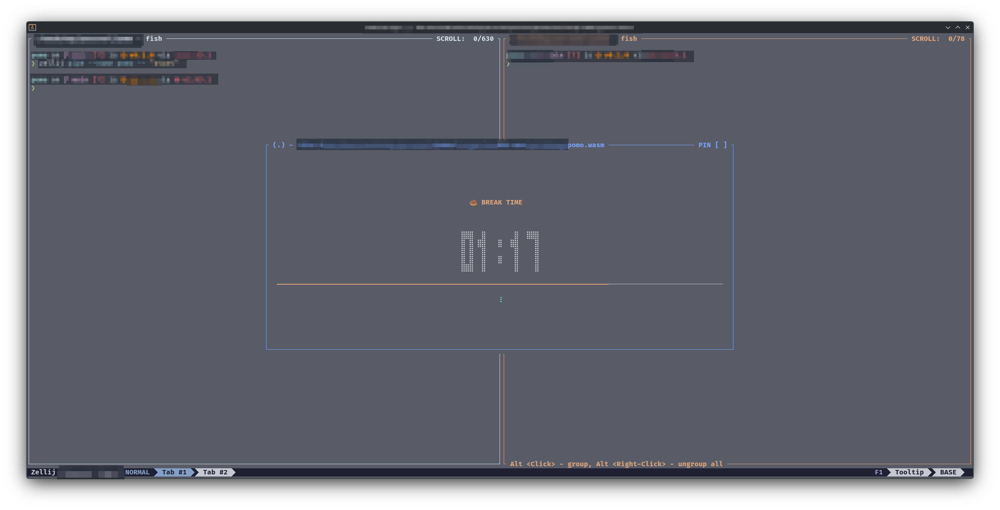

# pomo 🍅

A minimal pomodoro timer plugin for [Zellij](https://zellij.dev). It stays out of your way while you work (the plugin pane hides itself during work sessions) and takes over the screen with a big countdown when it's time for a break.



## How it works

- On load, the timer starts a work session automatically and hides its pane.
- When the work timer ends, the pane reappears as a break overlay: a large block-digit countdown, progress bar, and spinner.
- When the break ends, the pane hides again and the next work session starts on its own. The cycle repeats until you stop it.

## Installation

The classic 25 minutes of work / 5 minutes of break is the default, so all you need is to load the plugin and that's it. Add one line to your Zellij config (`~/.config/zellij/config.kdl`) and it starts with every session:

```kdl
load_plugins {
    "https://github.com/daneodekirk/zellij-pomo/releases/latest/download/pomo.wasm"
}
```

Alternatively, download `pomo.wasm` from the [releases page](https://github.com/daneodekirk/zellij-pomo/releases), or build it yourself (see [Building](#building)), and point Zellij at the file:

```kdl
load_plugins {
    "file:/path/to/pomo.wasm"
}
```

Or launch it manually in a pane:

```sh
zellij plugin -- file:/path/to/pomo.wasm
```

The plugin asks for the `ReadApplicationState`, `ChangeApplicationState`, and `ReadCliPipes` permissions on first load (needed to hide/show its own pane and to respond to `zellij pipe` commands without blocking the sending terminal).

## Building

Requires the Rust `wasm32-wasip1` target:

```sh
rustup target add wasm32-wasip1
cargo build --release --target wasm32-wasip1
```

The plugin lands at `target/wasm32-wasip1/release/pomo.wasm`.

## Configuration

| Option | Default | Description |
|---|---|---|
| `work_seconds` | `1500` (25 min) | Length of a work session |
| `break_seconds` | `300` (5 min) | Length of a break |

```kdl
load_plugins {
    "file:/path/to/pomo.wasm" {
        work_seconds "1500"
        break_seconds "300"
    }
}
```

## Keys

Keys apply when the plugin pane is focused:

| Key | Phase | Action |
|---|---|---|
| `Space` | work | Start / pause the timer |
| `r` | work | Reset the work timer (paused) |
| `h` | work | Hide the pane |
| `r` | finished | Start a new session (paused) |

Breaks are intentionally uninterruptible: no keys are handled during a break.

## Pipe commands

Control the timer from anywhere via Zellij pipes with the message name `pomo`:

```sh
# Start a session (optionally override work/break durations in seconds)
zellij pipe --name pomo -- "start"
zellij pipe --name pomo -- "start 1500 300"

# Stop the timer
zellij pipe --name pomo -- "stop"

# Hide / show the plugin pane
zellij pipe --name pomo -- "hide"
zellij pipe --name pomo -- "show"
```

## Compact mode

When the pane is small (fewer than 3 rows or 20 columns), the break screen falls back to a single-line `🍩 BREAK 04:59` display, and the work screen is always a single row (`🍅 24:59`), so the plugin works fine docked in a tiny pane as well as fullscreen.
